# Лабораторная работа №2

## Облачные вычислительные сервисы. Amazon EC2

**Молдавский Государственный университет**

**Выполнил:** Герганов Артём\
**Группа:** IA2404\
**Дисциплина:** Облачные вычисления\
**Выбранный уровень:** продвинутый\
**Выбранное приложение:** `open_capsules_php_functional` (TimeCapsule)\
**Вариант развертывания:** A --- ручное развертывание\
**Регион AWS:** `eu-central-1` (Frankfurt)\
**Репозиторий:** <https://github.com/Artimon4ik-cloud/timecapsule>

Кишинёв, 2026

------------------------------------------------------------------------

# 1. Теоретическая часть

## 1.1 Постановка задачи

В рамках лабораторной работы необходимо изучить основные возможности
облачной платформы AWS и получить практические навыки работы с
виртуальными серверами Amazon EC2.

Работа состоит из двух частей. В базовой части необходимо подготовить
AWS-аккаунт, настроить бюджет, создать экземпляр EC2, настроить сетевой
доступ, установить nginx, подключиться к серверу по SSH, разместить
статический сайт и выполнить остановку экземпляра через AWS CLI.

В продвинутой части необходимо развернуть веб-приложение TimeCapsule с
использованием nginx, PHP-FPM и PostgreSQL. Исходный код приложения
должен храниться в GitHub. Также необходимо выполнить обновление
приложения, проверить сохранность пользовательских данных, намеренно
сломать приложение, выполнить откат через Git и представить архитектуру
полученной системы.

## 1.2 Цель работы

Цель работы - научиться запускать и настраивать виртуальные машины
Amazon EC2, подключаться к ним по SSH, диагностировать их состояние и
разворачивать веб-приложение: от статической страницы до приложения с
базой данных и получением исходного кода из GitHub.

## 1.3 Основные этапы работы

1.  Подготовка AWS-аккаунта и настройка бюджета.
2.  Создание и запуск экземпляра Amazon EC2.
3.  Мониторинг и диагностика экземпляра.
4.  Подключение к серверу по SSH.
5.  Развертывание статического сайта.
6.  Управление экземпляром через AWS CLI.
7.  Создание GitHub Organization и репозитория.
8.  Подготовка сервера для TimeCapsule.
9.  Установка и настройка PostgreSQL.
10. Развертывание кода приложения.
11. Настройка nginx и PHP-FPM.
12. Ручное обновление приложения.
13. Выпуск новой версии, намеренная поломка и откат.
14. Создание архитектурной схемы и ADR.

------------------------------------------------------------------------

# 2. Практическая часть

## Часть 1. Базовый уровень

### Задание 1. Подготовка аккаунта

Для работы был выбран регион `eu-central-1` (Europe, Frankfurt). Был
создан IAM-пользователь `Artiom-cloud`, добавленный в группу `Admins` с
политикой `AdministratorAccess`. Для контроля расходов был создан бюджет
`ZeroSpend`.

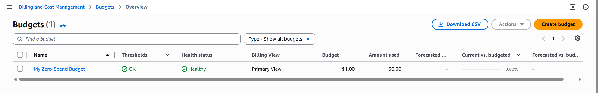

**Ответ на контрольный вопрос.** Политика `AdministratorAccess`
предоставляет практически полный доступ к сервисам и ресурсам AWS.
Root-пользователь обладает максимальными правами на аккаунт, поэтому его
не следует использовать для повседневной работы: безопаснее работать
через отдельного IAM-пользователя и выдавать только необходимые права.

### Задание 2. Запуск экземпляра EC2

Был создан экземпляр `webserver` на базе Amazon Linux 2023 типа
`t3.micro`. Для доступа использовалась пара ключей ED25519. В Security
Group `webserver-sg` был разрешён SSH-доступ на порт 22 только с
текущего IP-адреса и HTTP-доступ на порт 80 из интернета.

В User data был добавлен скрипт установки `htop` и nginx с
автоматическим запуском nginx. После запуска экземпляр перешёл в
состояние `Running`, а проверки состояния были успешно пройдены.


*Рисунок 1 - экземпляр `webserver` запущен и проходит проверки
состояния.*

После запуска по публичному IP открылась стандартная страница nginx.

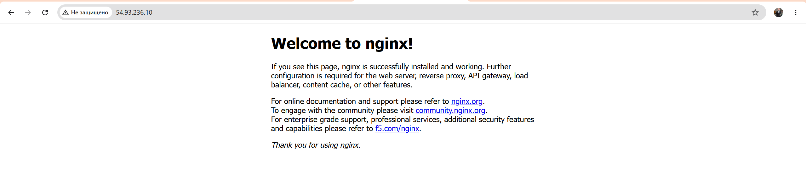

*Рисунок 2 - nginx доступен через публичный IP экземпляра.*

**Ответ на контрольный вопрос.** User data - это сценарий начальной
настройки экземпляра, который EC2 передаёт виртуальной машине при
запуске. В стандартном случае такой сценарий выполняется при первом
запуске экземпляра и не выполняется заново после обычной перезагрузки.

### Задание 3. Мониторинг и диагностика

На вкладке Monitoring были проверены метрики CloudWatch, включая
загрузку процессора, сетевой трафик и операции с диском.

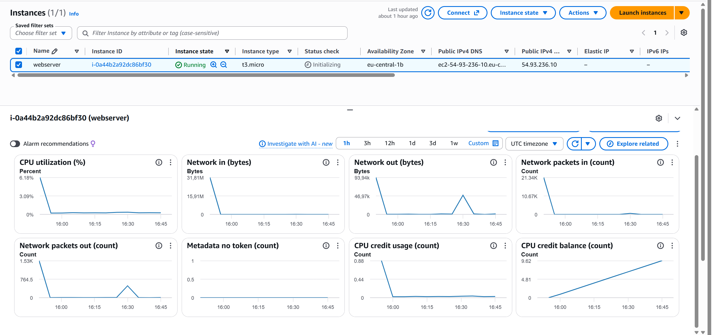

*Рисунок 3 - мониторинг экземпляра EC2.*

Также был просмотрен System log, в котором виден процесс загрузки
системы и выполнение команд начальной настройки.

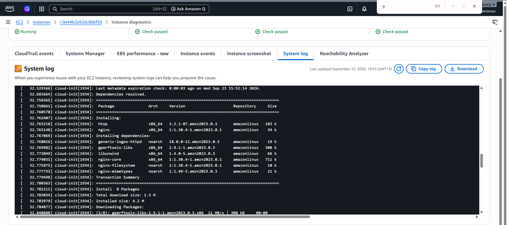

*Рисунок 4 - системный журнал экземпляра.*

**Ответ на контрольный вопрос.** `Instance status check` показывает
проблемы внутри виртуальной машины, которые часто может исправить
пользователь, например проблемы с загрузкой ОС. `System status check`
относится к инфраструктуре AWS, например физическому хосту или сети.
`Attached EBS status check` показывает доступность подключённых
EBS-томов.

**Ответ на контрольный вопрос.** Detailed monitoring полезен, когда
необходимо получать метрики с меньшим интервалом, например для
производственного сервера, поиска кратковременных скачков нагрузки или
более быстрой реакции системы мониторинга. Для обычной учебной машины
базового интервала обычно достаточно.

### Задание 4. Подключение по SSH

Подключение к экземпляру выполнялось из Windows PowerShell с помощью
приватного `.pem`-ключа. После подключения была проверена работа nginx
командой `systemctl status nginx`.

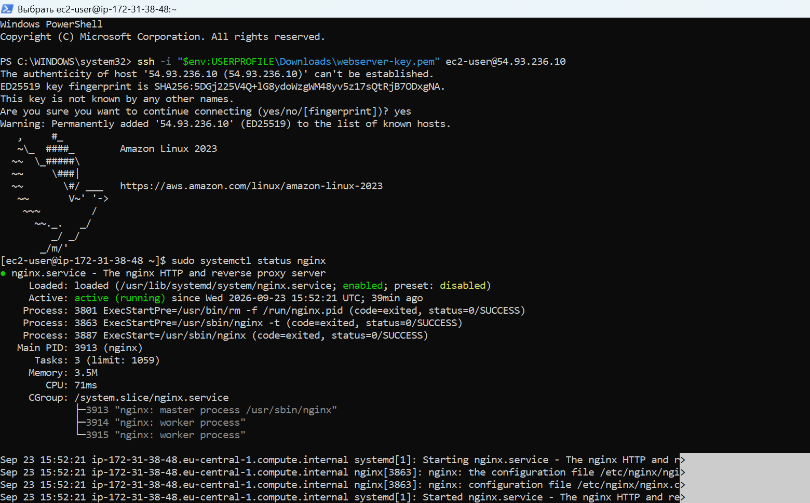

*Рисунок 5 - успешное SSH-подключение и проверка состояния nginx.*

**Ответ на контрольный вопрос.** SSH-ключ используется вместо обычного
пароля, потому что он значительно сложнее для перебора и не требует
передачи пароля серверу. Сервер проверяет, соответствует ли приватный
ключ пользователя сохранённому публичному ключу.

### Задание 5. Статический сайт

На локальном компьютере были подготовлены HTML-страницы и переданы на
EC2 с помощью `scp`. После этого файлы были скопированы в
`/usr/share/nginx/html`.

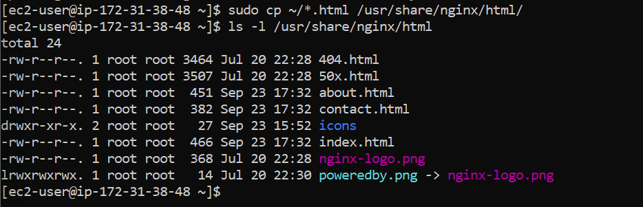

*Рисунок 6 - HTML-файлы размещены в каталоге nginx.*

После размещения файлов собственная страница стала доступна через
публичный IP.

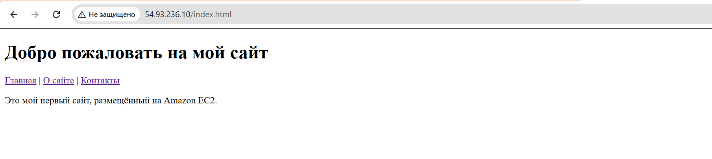

*Рисунок 7 - собственный статический сайт, размещённый на EC2.*

**Ответ на контрольный вопрос.** `scp` копирует файлы между компьютерами
через защищённое SSH-соединение. Он похож на `ssh` тем, что использует
тот же защищённый канал, адрес сервера и механизм аутентификации по
ключу, но предназначен именно для передачи файлов.

### Задание 6. Остановка экземпляра через AWS CLI

Экземпляр был остановлен из AWS CloudShell командой:

``` bash
aws ec2 stop-instances --instance-ids i-0a44b2a92dc86bf30 --region eu-central-1
```

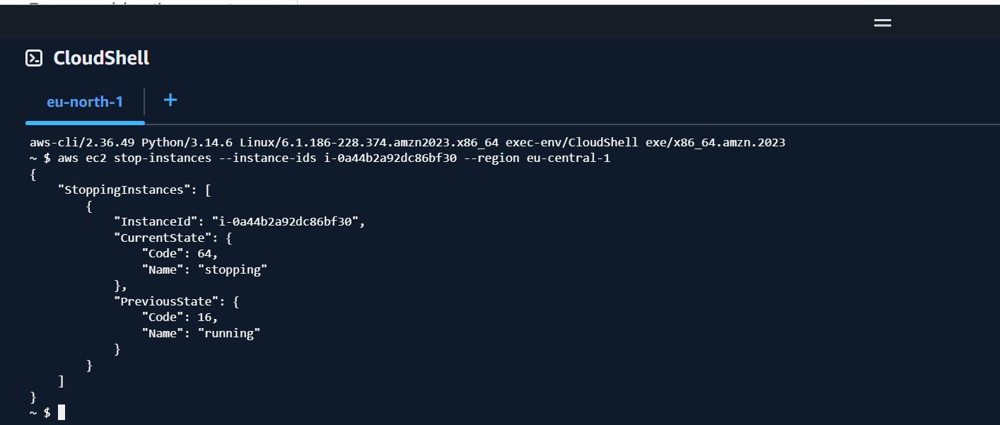

*Рисунок 8 - команда `aws ec2 stop-instances` и результат её
выполнения.*

**Ответ на контрольный вопрос.** `Stop` выключает виртуальную машину, но
сам экземпляр и его EBS-диски сохраняются, поэтому его можно снова
запустить. `Terminate` удаляет экземпляр окончательно; корневой EBS-том
также может быть удалён в зависимости от настройки
`DeleteOnTermination`. У остановленного экземпляра не начисляется плата
за вычислительное время EC2, но сохраняемые EBS-тома и некоторые другие
ресурсы могут продолжать тарифицироваться.

------------------------------------------------------------------------

## Часть 2. Продвинутый уровень

### Задание 7. Организация и репозиторий GitHub

Была создана организация GitHub `Artimon4ik-cloud` и публичный
репозиторий `timecapsule`. В корень репозитория был загружен проект
`open_capsules_php_functional`. В репозитории присутствуют `public`,
`src`, `views`, `composer.json` и остальные файлы приложения.

Репозиторий: <https://github.com/Artimon4ik-cloud/timecapsule>

**Ответ на контрольный вопрос.** Каталог `vendor/` не хранится в Git,
потому что зависимости могут быть восстановлены командой
`composer install` на основе `composer.lock`. Файл `.env` также исключён
через `.gitignore`, поскольку содержит параметры конкретного сервера и
секретные данные, в частности пароль базы данных.

### Задание 8. Подготовка сервера

Экземпляр `webserver` был снова запущен. После изменения публичного IP
правило SSH в Security Group было обновлено на текущий `My IP`.

На сервер были установлены Git, Composer, PostgreSQL 16 и необходимые
компоненты PHP 8.4:

``` bash
sudo dnf -y install git composer postgresql16-server \
    php8.4-fpm php8.4-cli php8.4-pgsql php8.4-mbstring php8.4-xml
```

После установки были проверены версия PHP и наличие драйвера
`pdo_pgsql`.

**Ответ на контрольный вопрос.** Эти пакеты устанавливались вручную, а
не добавлялись в User data, потому что экземпляр уже существовал после
первой части работы. Ручная установка также позволяет пошагово увидеть
процесс подготовки сервера и проверить результат каждого действия.

### Задание 9. База данных PostgreSQL

PostgreSQL был инициализирован командой `postgresql-setup --initdb`. Для
подключений по `localhost` метод `ident` был заменён на `scram-sha-256`,
после чего PostgreSQL был запущен и добавлен в автозапуск.

Были созданы пользователь `timecapsule` и база данных `timecapsule`.
Подключение было проверено командой:

``` bash
psql -h localhost -U timecapsule -d timecapsule -c "SELECT 1;"
```

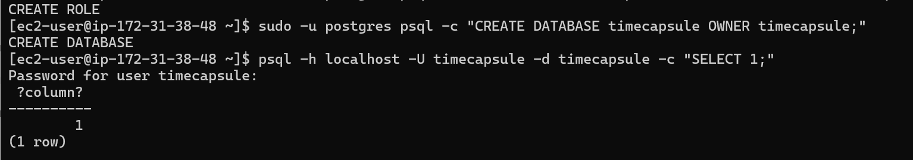

*Рисунок 9 - успешное подключение к PostgreSQL и результат
`SELECT 1`.*

### Задание 10. Развертывание кода приложения

Для приложения был создан каталог `/var/www/timecapsule`, после чего
публичный GitHub-репозиторий был клонирован на EC2 по HTTPS.

На сервере был создан локальный `.env` с адресом приложения и
параметрами PostgreSQL. Пароль базы данных в репозиторий не
публиковался. Для `.env` и каталога `storage` были настроены права,
позволяющие PHP-FPM работать от пользователя `apache`.

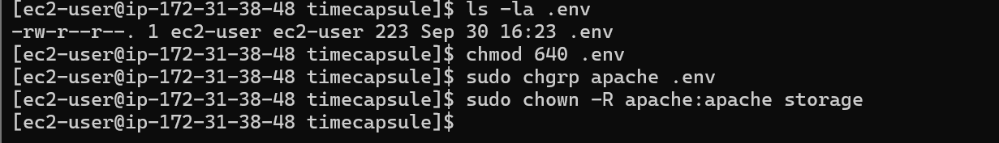

*Рисунок 10 - настройка прав доступа к `.env` и `storage`.*

Зависимости были установлены через Composer.

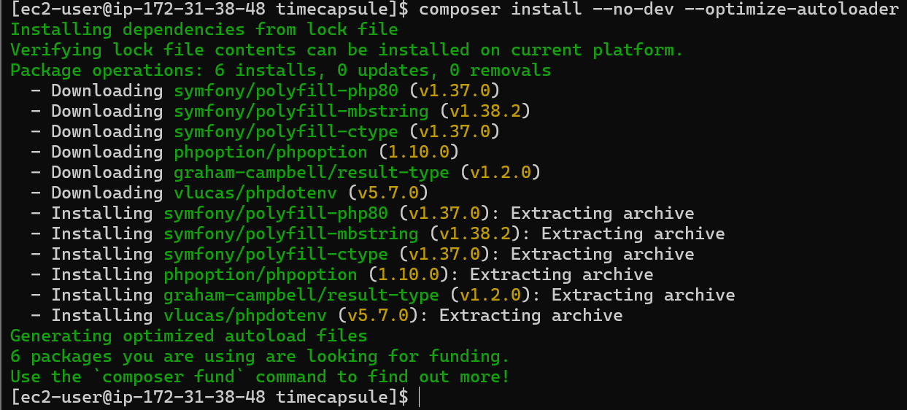

*Рисунок 11 - установка PHP-зависимостей приложения.*

После этого была выполнена инициализация базы данных:

``` bash
php bin/init-db.php
```

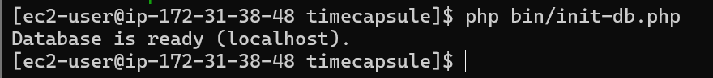

*Рисунок 12 - сообщение `Database is ready (localhost)`.*

**Ответ на контрольный вопрос.** Пароль базы хранится в `.env`, потому
что секреты не должны находиться в исходном коде и попадать в историю
Git. Публичность репозитория не раскрывает пароль, поскольку `.env`
исключён из Git, а nginx предоставляет из интернета только каталог
`public`; сервер скачивает публичный код без права отправлять изменения
обратно.

### Задание 11. Настройка PHP-FPM и nginx

В PHP был увеличен допустимый размер загружаемого файла, после чего
создана конфигурация nginx для TimeCapsule. Корневым каталогом сайта был
указан `/var/www/timecapsule/public`, а PHP-запросы передавались PHP-FPM
через Unix-сокет `/run/php-fpm/www.sock`.

Перед перезапуском nginx конфигурация была проверена:

``` bash
sudo nginx -t
```

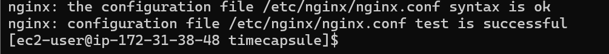

*Рисунок 13 - конфигурация nginx успешно прошла проверку.*

PHP-FPM был включён и запущен.

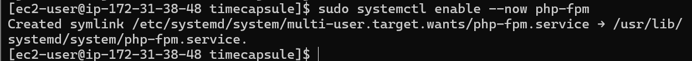

*Рисунок 14 - PHP-FPM запущен на сервере.*

После настройки в браузере открылась страница входа TimeCapsule.

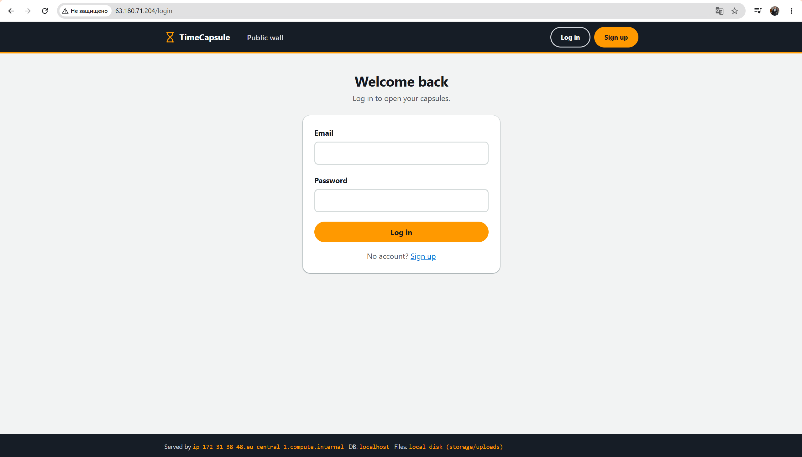

*Рисунок 15 - приложение TimeCapsule работает на EC2.*

Адрес `/health` вернул состояние приложения и базы данных:

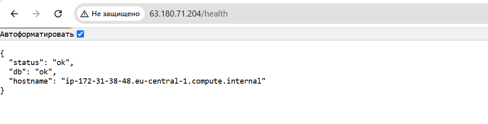

*Рисунок 16 - `/health` возвращает `status: ok` и `db: ok`.*

### Задание 12. Обновление приложения

Для специальности Informatică aplicată был использован вариант A ---
ручное развертывание. Изменения сначала отправлялись с локального
компьютера в GitHub, а затем на сервере выполнялась последовательность:

``` bash
cd /var/www/timecapsule
git pull --ff-only
composer install --no-dev --optimize-autoloader
php bin/init-db.php
sudo systemctl reload php-fpm
```

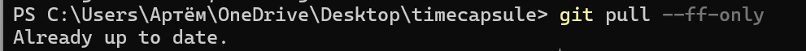

*Рисунок 17 - проверка и получение актуальной версии кода.*

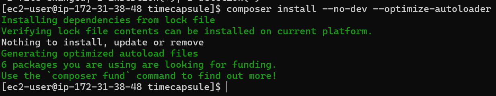

*Рисунок 18 - выполнение шагов ручного обновления приложения.*

После первого ручного обновления на странице появилась строка
`TimeCapsule — updated manually`.

**Ответ на контрольный вопрос.** `git pull` - изменения записываются частями, без гарантии, что всё сохранится одним шагом,
поэтому посетитель теоретически может открыть сайт в момент, когда часть
файлов уже обновилась, а часть ещё нет. Если после изменения кода не
выполнится `composer install`, новая версия может ожидать зависимости,
которых ещё нет в `vendor`, из-за чего приложение может перестать
работать.

### Задание 13. Новая версия, поломка и откат

Для проверки сохранения пользовательских данных была зарегистрирована
учётная запись и создана тестовая капсула с прикреплённым файлом.


*Рисунок 19 - тестовые капсулы с прикреплённым файлом.*

Затем в `views/layout.php` была добавлена заметная строка
`Author: Artiom Gherganov`. Изменение было отправлено в GitHub и
развернуто на EC2. После обновления капсулы остались на месте, что
подтверждает сохранение данных.

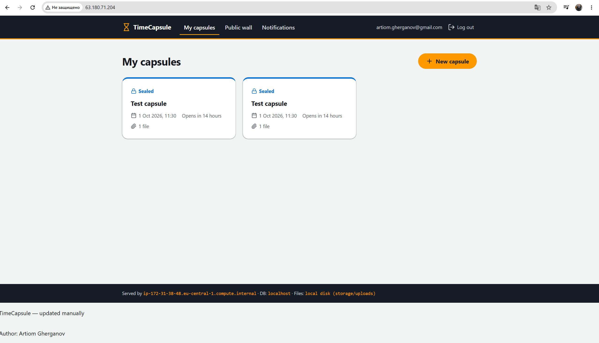

*Рисунок 20 - новая версия приложения с подписью автора; данные
приложения сохранены.*

После этого в шаблон была намеренно добавлена синтаксическая ошибка и
выполнен очередной deployment. Главная страница стала возвращать HTTP
500.

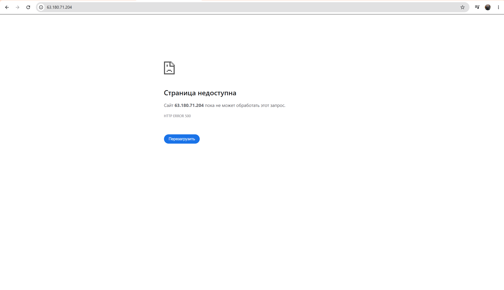

*Рисунок 21 - намеренно вызванная ошибка HTTP 500.*

При этом `/health` продолжал отвечать `ok`. Причина в том, что этот
endpoint проверяет запуск приложения и соединение с базой данных, но не
выполняет полный путь рендеринга основной страницы через повреждённый
шаблон. Поэтому такой health check не является полноценной end-to-end
проверкой пользовательского интерфейса.

Для отката на локальном компьютере была выполнена команда:

``` bash
git revert --no-edit HEAD
git push
```

После этого на сервере снова был выполнен deployment.

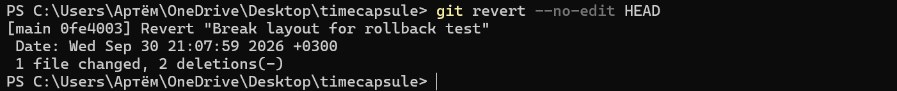

*Рисунок 22 - откат ошибочного изменения через Git.*

После повторного развертывания приложение снова стало работать, а
тестовые капсулы сохранились.

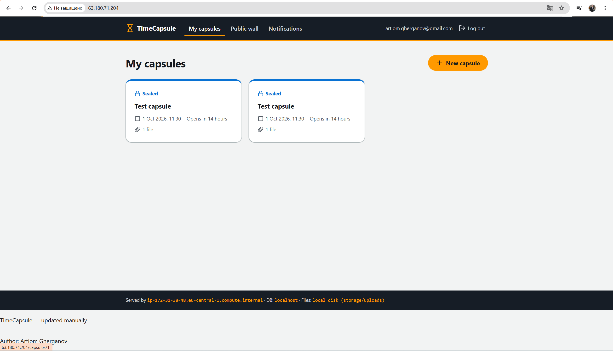

*Рисунок 23 - приложение работает после `git revert` и повторного
deployment.*

**Ответ на контрольный вопрос.** Сайт оставался недоступным с момента
развертывания ошибочного коммита до завершения отката и повторного
deployment. Это время включало обнаружение ошибки, создание
revert-коммита, `git push`, получение исправления сервером и
перезагрузку PHP-FPM. Сократить простой можно автоматическими тестами
перед выпуском, атомарным deployment, автоматической проверкой health
endpoint и автоматическим rollback.

### Задание 14. Архитектура и архитектурное решение

Была создана схема развертывания. На ней показаны пользователь,
компьютер разработчика, GitHub и инфраструктура AWS: регион
`eu-central-1`, Default VPC, Availability Zone, Subnet, Security Group и
EC2. Внутри EC2 находятся nginx, PHP-FPM и PostgreSQL.

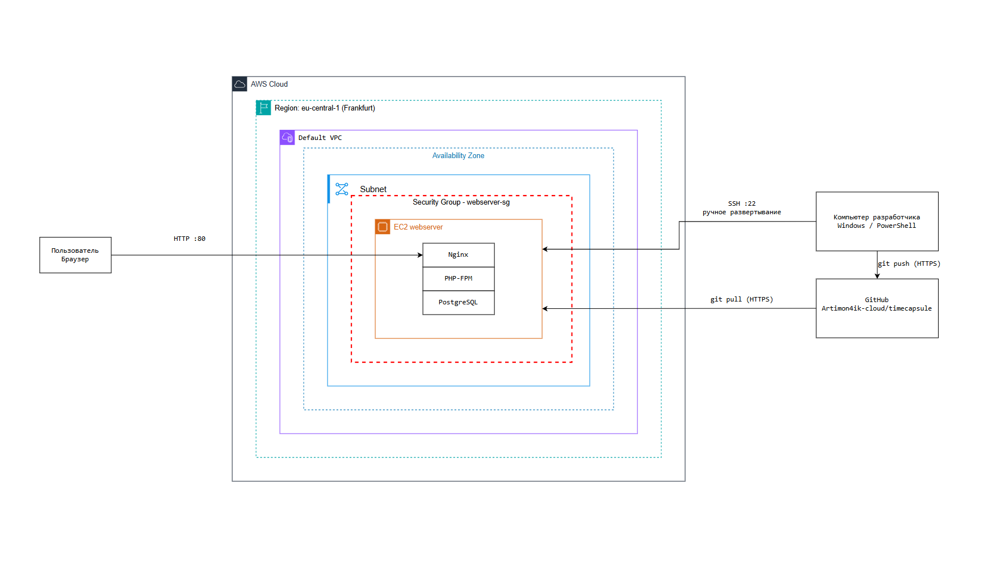

*Рисунок 24 - архитектура развертывания TimeCapsule в AWS.*

Поток пользовательского запроса выглядит следующим образом: браузер
отправляет HTTP-запрос на порт 80 EC2; nginx принимает запрос и передаёт
PHP-запрос PHP-FPM; PHP-код при необходимости обращается к PostgreSQL;
ответ возвращается через PHP-FPM и nginx обратно пользователю.

Код хранится в GitHub. С локального компьютера разработчик выполняет
`git push`, а EC2 получает новую версию командой `git pull` по HTTPS.
Управление сервером и ручной deployment выполняются через SSH.

Для фиксации решения о способе развертывания создан ADR:

<https://github.com/Artimon4ik-cloud/timecapsule/blob/main/docs/adr/0001-deploy-method.md>

В ADR были рассмотрены три способа доставки кода: `scp`, ручной
`git pull` и `deploy.sh`. Для данной работы выбран ручной вариант через
Git, соответствующий варианту A.

------------------------------------------------------------------------

# 3. Дополнительные контрольные вопросы продвинутого уровня

## 3.1 Как проходит запрос от браузера до базы данных?

Браузер отправляет HTTP-запрос на публичный IP EC2 и порт 80. nginx
принимает запрос: статические файлы он может вернуть самостоятельно, а
PHP-запрос передаёт PHP-FPM. PHP-FPM выполняет код приложения, который
при необходимости подключается к PostgreSQL на `localhost`, получает
данные и формирует ответ, возвращаемый пользователю через nginx.

## 3.2 Почему сервер может скачивать код, но не может отправлять изменения?

Репозиторий является публичным, поэтому сервер может читать его по HTTPS
без учётных данных. Для `git push` требуется аутентификация с правом
записи, которой EC2 не предоставлялось. Это безопаснее: даже при
компрометации сервера злоумышленник не получает автоматически право
изменять исходный репозиторий.

## 3.3 Что произойдёт с загруженными файлами при удалении EC2?

Загруженные файлы TimeCapsule находятся на локальном диске экземпляра в
`storage/uploads`, то есть на файловой системе EBS. При `Terminate`
корневой EBS-том обычно удаляется, если для него включён
`DeleteOnTermination`, поэтому пользовательские файлы могут быть
потеряны. Для реального приложения такие данные следует хранить отдельно
от жизненного цикла одного EC2, например на отдельном постоянном томе
или в объектном хранилище.

## 3.4 Что общего у ручного deployment с CI/CD?

Последовательность варианта A уже содержит типичные этапы deployment
pipeline: получение новой версии кода, установка зависимостей,
обновление структуры базы и перезапуск приложения. Однако процесс
запускается человеком и не содержит автоматических тестов, сборки
артефакта, автоматической проверки результата, атомарного переключения
версии и автоматического rollback, которые обычно присутствуют в
полноценном CI/CD.

------------------------------------------------------------------------

# 4. Вывод

В ходе лабораторной работы были изучены основные возможности Amazon EC2
и выполнено полное развертывание веб-приложения в AWS. Был создан и
настроен экземпляр Amazon Linux 2023, настроены Security Group,
SSH-доступ, nginx, PHP-FPM и PostgreSQL.

В базовой части был развернут статический сайт и выполнено управление
экземпляром через AWS CLI. В продвинутой части исходный код TimeCapsule
был размещён в GitHub, приложение развернуто на EC2 и подключено к
PostgreSQL. Был проверен процесс ручного выпуска новой версии,
сохранность пользовательских данных, намеренная ошибка HTTP 500 и
восстановление приложения через `git revert`.

Также была создана архитектурная схема системы и ADR с выбором способа
развертывания. В результате были получены практические навыки работы с
EC2, Linux-сервером, Git/GitHub, nginx, PHP-FPM, PostgreSQL и базовым
процессом deployment.

------------------------------------------------------------------------

# 5. Использованные источники

1.  Методические указания к лабораторной работе №2 «Облачные
    вычислительные сервисы. Amazon EC2».
2.  Материалы лекции 4 «Вычислительные сервисы. Amazon EC2 и machine
    identity».
3.  AWS Management Console.
4.  Документация Amazon EC2.
5.  GitHub - репозиторий проекта TimeCapsule:
    <https://github.com/Artimon4ik-cloud/timecapsule>
6.  ADR проекта:
    <https://github.com/Artimon4ik-cloud/timecapsule/blob/main/docs/adr/0001-deploy-method.md>
